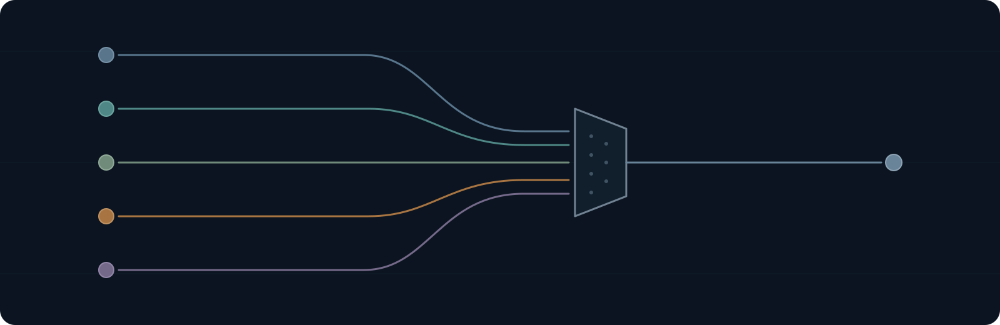
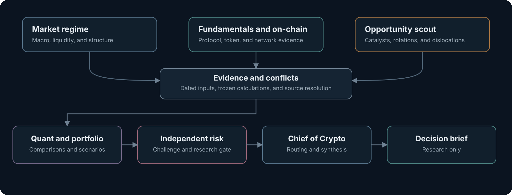

# Crypto Research Desk

**Research-only crypto market intelligence with five specialist functions and an independent risk gate.**

The desk tests market-regime claims and compares current evidence. It frames scenarios while keeping every external action with the human operator.

The repository contains the original Codex research workflow and an optional browser workbench for named-ticker forecast packets. The workbench validates submitted structure; it does not fetch market data or authenticate an independent review.

## The desk

| Function | Owns | Produces |
| --- | --- | --- |
| [Market regime](.codex/agents/market-regime.toml) | Macro, liquidity, flows, derivatives, breadth, and cycle structure | Regime packet |
| [Fundamentals and on-chain](.codex/agents/fundamental-onchain.toml) | Protocol design, token mechanics, value capture, governance, and network evidence | Diligence packet |
| [Opportunity scout](.codex/agents/opportunity-scout.toml) | Catalysts, sector rotations, narratives, and market dislocations | Candidate queue |
| [Quant and portfolio](.codex/agents/quant-portfolio.toml) | Calculations, signal tests, relative ranking, scenarios, and portfolio interaction | Comparison packet |
| [Independent risk](.codex/agents/risk-officer.toml) | Mandate checks, downside challenge, liquidity, and unresolved uncertainty | Risk verdict |

The Chief of Crypto routes the work, resolves evidence conflicts, and delivers one decision-ready brief. The Chief is not a sixth specialist.

## Research flow



The first three functions work independently. Their packets are reconciled before Quant. Independent Risk receives the evidence and proposed conclusions without the producers' persuasive rationale. The Chief resolves contradictions by evidence and sends one brief to the human operator.

## Use the research workflow

Requirements:

- Codex with project agents and local skills support.
- Read access to public research sources.
- No exchange, broker, wallet, or custody connection.

Clone the repository, open the folder in Codex, then request a market read:

```text
Use $crypto-fund-research to test the current crypto market regime. Treat a bull cycle as a hypothesis, use current evidence, and send every material conclusion through Independent Risk.
```

For a named ticker:

```text
Use $crypto-fund-research to produce a risk-cleared BTC price probability analysis for 12 hours, 24 hours, 3 days, and 7 days from one exact reference price.
```

## Use the browser workbench

Open the [verified production workbench](https://crypto-research-desk.vercel.app), or run the same static app locally. It has no account, wallet, trading, analytics, or research-upload connection.

Requirements: Node 24.x and a current Chromium or Firefox browser.

```sh
npm ci --ignore-scripts
npm run dev
```

Open [the local workbench](http://127.0.0.1:4173). Start with a blank packet or inspect the clearly labeled fictional DEMO example. Edit routine research, source, scenario, method, and review fields in the guided form; use the full packet editor for exact JSON. Then export JSON, a Markdown brief, or a printable chart.

Saving is off by default. Optional browser storage keeps one unencrypted local draft; it is not a backup or a verified review system. Invalid input is rejected without replacing the open packet. Material edits reset the recorded review, and missing evidence or elapsed horizons withhold the chart.

Read the [packet guide](docs/WORKBENCH.md), [deployment runbook](docs/DEPLOYMENT.md), and [security policy](SECURITY.md). The browser format covers named-ticker forecasts, not the full market-scan run ledger or conflict-resolution workflow.

## Forecast contract

| Requirement | Rule |
| --- | --- |
| Reference | One exact price, capture time, and timezone across every horizon |
| Horizons | 12 hours, 24 hours, 3 days, and 7 days |
| Scenarios | Mutually exclusive price ranges totaling 100% within each horizon |
| Chart | `Price target range by horizon`, built from the final scenario thresholds |
| Failure behavior | Return `UNKNOWN` and `INCOMPLETE` when evidence cannot support the output |

The research workflow requires an independent Risk gate before delivery. The browser displays submitted thresholds and labels review dispositions as unauthenticated, including warning dispositions.

Probabilities are not added across horizons. Unsupported values are never invented.

## Evidence controls

- Facts and forecasts stay distinct from calculations, assumptions, and inferences.
- Material numbers carry a source date. Price-sensitive inputs carry a capture time.
- Search results are discovery leads. Current claims require the opened source.
- Conflicting figures are resolved at the source or presented separately with the reason they differ.
- Every promoted thesis includes its strongest disconfirming evidence and an invalidation condition.

## Safety boundary

This project cannot:

- Place trades or manage capital.
- Connect accounts or handle credentials.
- Sign transactions or transfer assets.

Research visibility never grants execution authority. The human operator owns every external action.

## Validation status

The exact-byte verifier protects the released research core, its five specialist definitions, and the original presentation assets. Additional tests exercise packet parsing, scenario arithmetic, review gates, safe rendering, local persistence, build integrity, and browser workflows.

The protected research core and optional browser workbench have independent versions. Verified build manifests record both, so workbench maintenance does not silently relabel unchanged research instructions.

These are software and workflow checks. They do not establish forecast accuracy, investment performance, authentic reviewer identity, or future reliability. A local pass does not prove a Vercel production release; that requires the separate acceptance checks in the [deployment runbook](docs/DEPLOYMENT.md).

## Repository map

| Path | Purpose |
| --- | --- |
| [`AGENTS.md`](AGENTS.md) | Authority, routing, evidence, and delivery rules |
| [`.agents/skills`](.agents/skills) | Reusable research workflow |
| [`.codex/agents`](.codex/agents) | Five read-only specialist definitions |
| [`examples`](examples) | Sample research requests |
| [`assets`](assets) | Local README graphics |
| [`web`](web) | Browser workbench and packet validation |
| [`docs`](docs) | Packet format, privacy boundaries, and deployment runbook |
| [`tests`](tests) | Core, packet, build, browser, and accessibility regression checks |
| [`tools/verify_release.py`](tools/verify_release.py) | Exact core, configuration, and presentation verifier |
| [`RELEASE_POLICY.md`](RELEASE_POLICY.md) | Versioning and publication gates |

## Verify locally

Use Python 3.11 or later for the research-core checks:

```sh
python3 -B tools/verify_release.py
python3 -B -m unittest discover -s tests -v
npm run check
```

On Windows, use `py` in place of `python3`. The checked-in `.nvmrc` selects Node 24 in compatible version managers.

These checks make no network request once dependencies are installed. For browser tests:

```sh
npx playwright install chromium firefox
npm run test:browser
```

For an authorized live deployment, set `PRODUCTION_URL` to its HTTPS origin and run `npm run test:production`. That separate smoke compares the deployed build manifest with the local reviewed artifact and checks the production browser flow and headers.

Browser installation requires a download. `npm run test:browser` rebuilds and verifies `dist/` before the browser suite; the tests use only fictional local packets. To inspect the production artifact, run `npm run build` followed by `npm run preview`. The build has no runtime package dependency.

## License

Released under the [MIT License](LICENSE).
